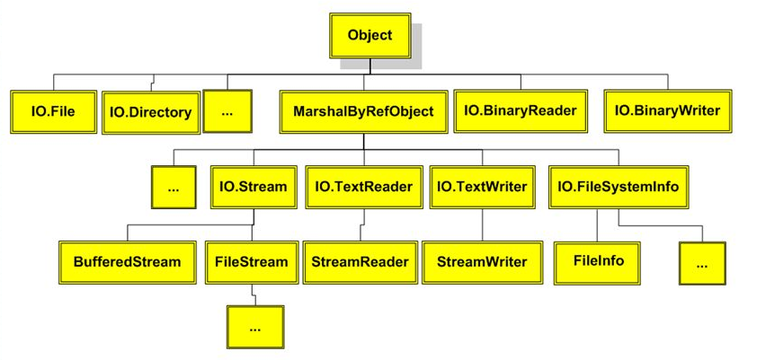

# C# Working with Files

## System.IO Namespace

| class      | Description         
| ------------- |:-------------:|  
|   BinaryReader    | Reads primitive data from a binary stream. |
| BinaryWriter | Writes primitive data in binary format. |
| BufferedStream | A temporary storage for a stream of bytes. |
| Directory | Helps in manipulating a directory structure.  |
| DirectoryInfo | Used for performing operations on directories.|
| DriveInfo | Provides information for the drives. |
| File | Helps in manipulating files. | 
| FileInfo | Used for performing operations on files. |
| FileStream | Used to read from and write to any location in a file. |
| MemoryStream | Used for random access to streamed data stored in memory. |
| Path | Performs operations on path information.  |
| StreamReader | Used for reading characters from a byte stream.|
| StreamWriter | Is used for writing characters to a stream. |
| StringReader | Is used for reading from a string buffer. | 
| StringWriter | Is used for writing into a string buffer. |



### File Class
- Namespace: System.IO
- Assemblies: System.IO.FileSystem.dll, mscorlib.dll, netstandard.dll
- *Provides static methods for the creation, copying, deletion, moving, and opening of a single file, and aids in the creation of FileStream objects.*
***Example:***  
```C#
using namespace System;
using namespace System::IO;
int main()
{
   String^ path = "c:\\temp\\MyTest.txt";
   if (  !File::Exists( path ) )
   {
      
      // Create a file to write to.
      StreamWriter^ sw = File::CreateText( path );
      try
      {
         sw->WriteLine( "Hello" );
         sw->WriteLine( "And" );
         sw->WriteLine( "Welcome" );
      }
      finally
      {
         if ( sw )
                  delete (IDisposable^)(sw);
      }
   }

   // Open the file to read from.
   StreamReader^ sr = File::OpenText( path );
   try
   {
      String^ s = "";
      while ( s = sr->ReadLine() )
      {
         Console::WriteLine( s );
      }
   }
   finally
   {
      if ( sr )
            delete (IDisposable^)(sr);
   }

   try
   {
      String^ path2 = String::Concat( path, "temp" );
      
      // Ensure that the target does not exist.
      File::Delete( path2 );
      
      // Copy the file.
      File::Copy( path, path2 );
      Console::WriteLine( "{0} was copied to {1}.", path, path2 );
      
      // Delete the newly created file.
      File::Delete( path2 );
      Console::WriteLine( "{0} was successfully deleted.", path2 );
   }
   catch ( Exception^ e ) 
   {
      Console::WriteLine( "The process failed: {0}", e );
   }
}
```
#### Methods:
- *AppendAllLines()*  
- *AppendAllText()*  
  Opens a file, appends the specified string to the file, and then closes the file. If the file does not exist, this method creates a file, writes the specified string to the file, then closes the file.
- *AppendText()*  
  Creates a StreamWriter that appends UTF-8 encoded text to an existing file, or to a new file if the specified file does not exist.
- *Copy()*  
  Copies an existing file to a new file. Overwriting a file of the same name is not allowed.
- *Create()*  
  Creates or overwrites a file in the specified path.
- *Decrypt()*
- *Delete()*
  Deletes the specified file.
- *Encrypt()*
- *Exists()*
  Determines whether the specified file exists.
- *GetAccessControl()*
- *GetAttributes()*
- *GetCreationTime()*
  Returns the creation date and time of the specified file or directory.
- *GetLastAccessTime()*
  Returns the date and time the specified file or directory was last accessed.  
- *GetLastWriteTime()*
  Returns the date and time the specified file or directory was last written to.  
- *Move()*
  Moves a specified file to a new location, providing the option to specify a new file name.
- *Open()*
- *OpenRead(String)*
- *OpenWrite(String)*
- *ReadAllBytes(String)*
- *ReadAllLines(String)*
- *ReadAllText(String)*
- *ReadLines(String)*
- . . .
---
